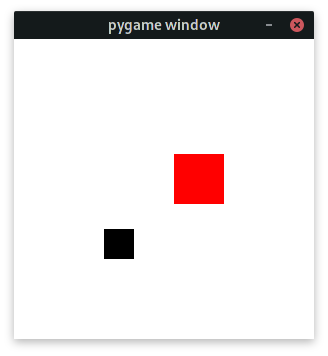
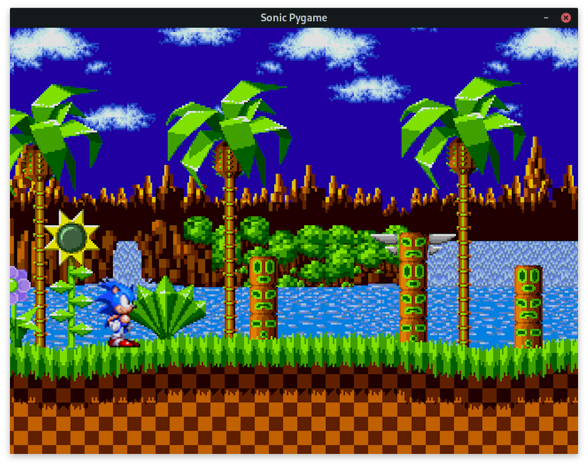
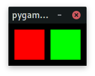

# DESAFIOS

### DESAFIO 1
[**VER A SOLUÇÃO**](./solucao_desafio1.py)

Construa um jogo com **dois retângulos** na tela. Você deverá controlar um deles e assim que ele colidir com o segundo, este deverá **mudar sua posição** na tela.

### DESAFIO 2
[**VER A SOLUÇÃO**](./solucao_desafio2.py)

Construa um jogo com uma **imagem de cenário** e uma **imagem de personagem** que consegue se mover.

### DESAFIO 3
[**VER A SOLUÇÃO**](./solucao_desafio3.py)

Construa um jogo com **dois retângulos** na tela. Cada um deve tocar uma música específica ao ser clicado.

### DESAFIO 4
[**VER A SOLUÇÃO**](./solucao_desafio4.py)

Adicione um pouco de movimento ao [**desafio 2**](#desafio-2). Implemente uma classe de sprites e dê vida ao seu personagem.

