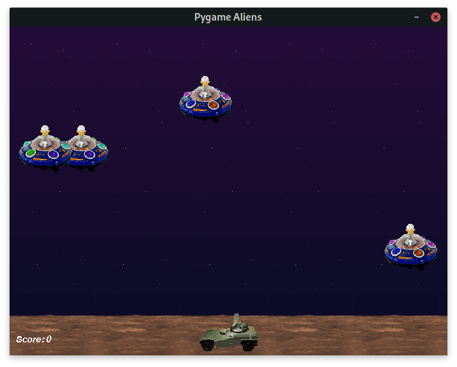
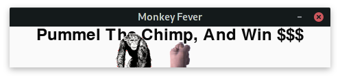
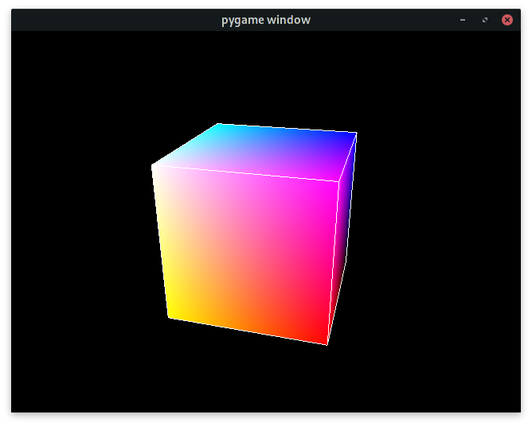
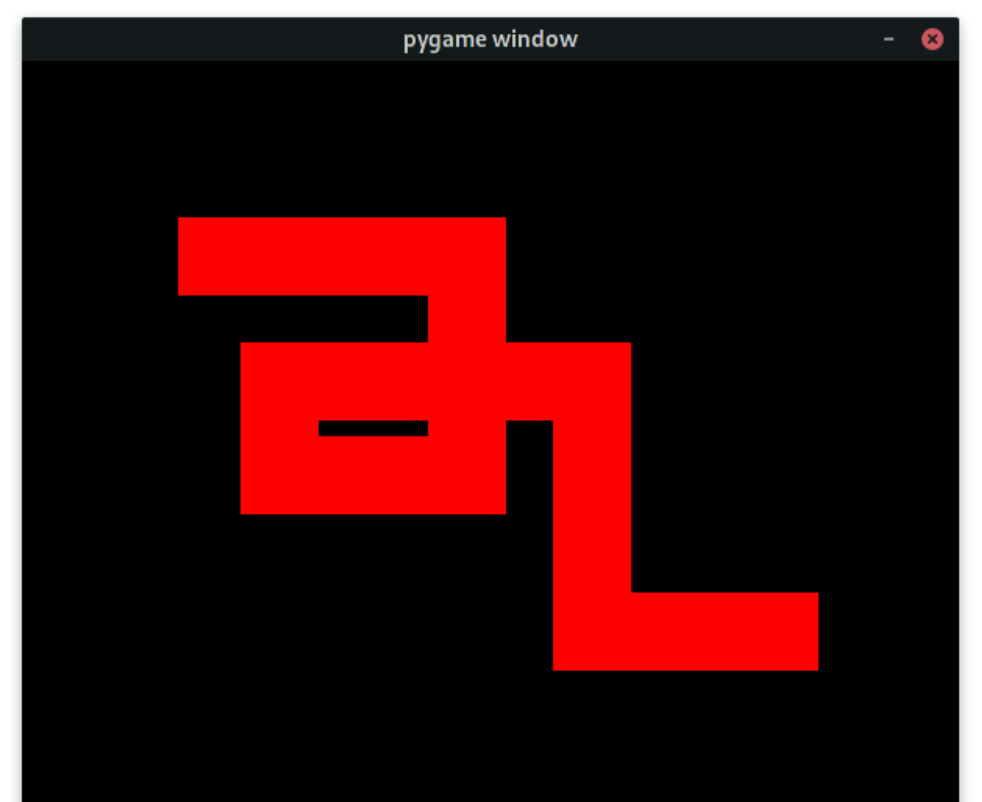
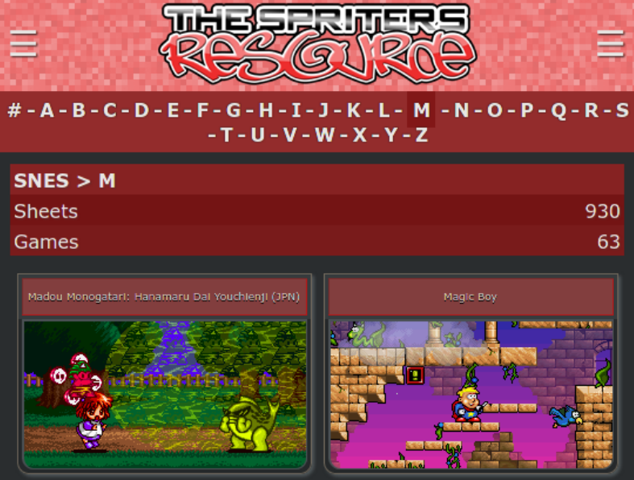
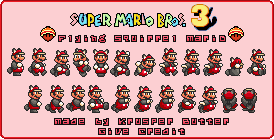

# CRIANDO O SEU PRIMEIRO JOGO COM PYTHON E PYGAME

Tutorial ministrado por [João Paulo Carvalho](https://jjpaulo2.github.io) na **Python Brasil 2020**. Estou no [GitHub](https://github.com/jjpaulo2), [Instagram](https://instagram.com/jjpaulo2) e [Telegram](https://t.me/jjpaulo2) como **@jjpaulo2**. [Acesse aqui](./slide.pdf) o slide utilizado no tutorial.

### Por que PyGame?

- Feito em Python.
- Simples de aprender.
- Gratuito, distribuido sob a LGPL.
- Processamento Multi-Core nativo.
- Compatível com qualquer sistema operacional.
- Construa seus jogos da forma que quiser.

### Projetos da comunidade

Em [pygame.org](https://www.pygame.org) você pode encontrar um catálogo gigantesco com projetos da comunidade.

| [](https://www.youtube.com/watch?v=Et1YKMD0zM4) | [](https://www.youtube.com/watch?v=chZZpo85b-g) |
|-|-|
| [Python DOOM](https://github.com/StanislavPetrovV/Python-DOOM) | [Barbie Seahorse Adventures](http://www.imitationpickles.org/barbie/) |

> A documentação oficial da biblioteca está disponível em [pygame.org/docs](https://www.pygame.org/docs).

## Instalação

Assumindo que você já preparou um **ambiente virtual do Python**, apenas execute o seguinte comando.

```shell
$ pip install pygame
```

Ou se preferir usar o **Pipenv**.

```shell
$ pipenv install pygame
```

Você pode testar alguns exemplos embutidos na própria biblioteca através do módulo `pygame.examples`.

```shell
$ python -m pygame.examples.aliens
```


```shell
$ python -m pygame.examples.chimp
```



### Camada 3D

Assumindo que você está dentro do **ambiente virtual do Python** utilizado previamente, apenas execute o seguinte comando.

```shell
$ pip install pyopengl numpy
```

Ou se preferir usar o **Pipenv**.

```shell
$ pipenv install pyopengl numpy
```

O módulo de exemplos também possui alguns exemplos em 3D.

```shell
$ python -m pygame.examples.glcube
```


## Primeiro jogo

O código a seguir é funcional. Não se preocupe. Em breve você entenderá o que significa cada coisa nesse código.

```python
# IMPORTANDO A BIBLIOTECA
import pygame

# INICIALIZANDO O PYGAME
pygame.init()

# CRIANDO NOSSA JANELA
tela = pygame.display.set_mode([600, 800])

# DEFININDO O RELÓGIO QUE VAI CONTAR OS FRAMES POR SEGUNDO
clock = pygame.time.Clock()

# CRIANDO UM QUADRADO QUE SERÁ EXIBIDO NA TELA
quadrado = pygame.Rect(100,  100,  50,  50)

# LOOP PRINCIPAL DO JOGO
executando = True
while executando:

	# VERIFICANDO EVENTOS
	for evento in pygame.event.get():

		# EVENTO DE FECHAR A TELA
		if evento.type == pygame.QUIT:
			executando = False

		# EVENTOS DE TECLA PRESSIONADA
		if evento.type == pygame.KEYDOWN:
			if evento.key == pygame.K_DOWN:
				quadrado.move_ip([0, 20])
			if evento.key == pygame.K_UP:
				quadrado.move_ip([0, -20])
			if evento.key == pygame.K_LEFT:
				quadrado.move_ip([-20, 0])
			if evento.key == pygame.K_RIGHT:
				quadrado.move_ip([20, 0])

	# ELEMENTOS DA TELA
	pygame.draw.rect(tela, (255, 0, 0), quadrado)

	# CONFIGURAÇÃO DE QUADROS
	clock.tick(27)
	pygame.display.update()

pygame.quit()
```

O resultado desse código é como na imagem a seguir. Um quadrado que se move na tela e deixa seu rastro.



## COMPREENDENDO CONCEITOS

### Janelas <sup>[_[ver documentação]_](https://www.pygame.org/docs/ref/display.html)</sup>

Onde todo o conteúdo que você vai criar será exibido.

```python
# DEFININDO DIMENSÃO DA TELA
# É IMPORTANTE GUARDAR A INSTÂNCIA DA TELA PARA PODER FAZER MANIPULAÇÕES
tela = pygame.display.set_mode([300, 300])

# DEFININDO O TÍTULO DA JANELA
pygame.display.set_caption("Título da minha janela")
```

### Loop principal

O loop que acontece durante a execução do jogo. É onde toda a lógica irá ser moldada.

```python
# DEFININDO UMA FLAG PRA VERIFICAR A EXECUÇÃO
executando = True
while executando:
	
	# OBTENDO OS EVENTOS E ITERANDO SOBRE ELES
	for evento in pygame.event.get():
		
		# VERIFICANDO SE HOUVE SOLICITAÇÃO PRA FECHAR A JANELA
		if evento.type == pygame.QUIT:
            		executando = False

# INDICANDO O FIM DO SCRIPT DO PYGAME
pygame.quit()
```

### Quadros / Clock <sup>[_[ver documentação]_](https://www.pygame.org/docs/ref/time.html)</sup>

O relógio que marca e define a quantidade de loops que acontecerão em 1 segundo.

```python
# CRIANDO O OBJETO CLOCK
clock = pygame.time.Clock()
...

while executando:
	...

	# MANDA O RELÓGIO RODAR PARA SER CAPAZ DE 
	# EXIBIR 30 QUADROS POR SEGUNDO
	clock.tick(30)
	
	# MÉTODO QUE ATUALIZA A TELA
	pygame.display.update()
```

### Cores <sup>[_[ver documentação]_](https://www.pygame.org/docs/ref/color.html)</sup>

Cores no PyGame são representadas por tuplas do tipo 
`(red: int, green: int, blue: int)`.

```python
VERMELHO = (255, 0, 0)
AZUL = (0, 0, 255)
VERDE = (0, 255, 0)
BRANCO = (255, 255, 255)
PRETO = (0, 0, 0)
CINZA = (150, 150, 150)
```

### Eventos <sup>[_[ver documentação]_](https://www.pygame.org/docs/ref/event.html)</sup>

Ações que podem ser tratadas durante o loop principal do seu jogo. Elas podem ser de vários tipos e possuem parâmetros que podem ser lidos para tratá-los.

```python
while executando:
	...
	
	# EVENTO DE SAIR DO JOGO
	if evento.type == pygame.QUIT:
			...

	# EVENTOS DE TECLA PRESSIONADA
	if evento.type == pygame.KEYDOWN:
		if evento.key == pygame.K_DOWN:
			...
```

Veja a tabela a seguir com os principais tipos de eventos e seus paramêtros.

| Tipo de evento | Parâmetros |
|-|-|
| QUIT | none |
| ACTIVEEVENT | gain, state |
| KEYDOWN | key, mod, unicode, scancode |
| KEYUP | key, mod |
| MOUSEMOTION | pos, rel, buttons |
| MOUSEBUTTONUP | pos, button |
| MOUSEBUTTONDOWN | pos, button |
| VIDEORESIZE | size, w, h |
| USEREVENT | code |

### Retângulos <sup>[_[ver documentação]_](https://www.pygame.org/docs/ref/rect.html)</sup>

Retângulos no PyGame são declarados por objetos da forma `pygame.Rect(left: float, top: float, width: float, height: float)`.

```python
# DECLARANDO RETÂNGULO
retangulo = pygame.Rect(10, 10, 30, 30)
...

while executando:
	...
	
	# MÉTODO QUE DESENHA O RETÂNGULO NA TELA
	pygame.draw.rect(tela, cor, retangulo)
```

### Colisões <sup>[_[ver documentação]_](https://www.pygame.org/docs/ref/rect.html#pygame.Rect.contains)</sup>

A classe Rect possui métodos capazes de verificar colisões.

```python
# VERIFICA SE O RETÂNGULO CONTÉM O OUTRO PASSADO COMO PARÂMETRO
pygame.Rect.contains(Rect) -> bool

# VERIFICA SE O RETÂNGULO CONTÉM O PONTO PASSADO COMO PARÂMETRO
pygame.Rect.collidepoint(x, y) -> bool

# VERIFICA SE O RETÂNGULO SE COLIDIU COM O OUTRO
pygame.Rect.colliderect(Rect) -> bool

# VERIFICA SE ALGUM RETÂNGULO DA LISTA COLIDIU COM O OBJETO
pygame.Rect.collidelist(list[Rect]) -> bool

# VERIFICA SE TODOS OS RETÂNGULO DA LISTA COLIDIRAM COM O OBJETO
pygame.Rect.collidelistall(list[Rect]) -> bool
```

> ### DESAFIO 1
> [**VER A SOLUÇÃO**](./desafios/solucao_desafio1.py)
>
> Construa um jogo com **dois retângulos** na tela. Você deverá controlar um deles e assim que ele colidir com o segundo, este deverá **mudar sua posição** na tela.
>
> 

### Superfícies <sup>[_[ver documentação]_](https://www.pygame.org/docs/ref/surface.html)</sup>

Elas nos permitem ir além de apenas retângulos coloridos e nos dá o poder de começar a manipular imagens. Superficies são criadas através de `pygame.Surface((width, height))`.

```python
# CRIANDO A SUPERFÍCIE DE DIMENSÕES (largura, altura)
superficie = pygame.Surface((200, 200))
...

while executando:
	...

	# MÉTODO QUE DESENHA A SUPERFÍCIE NA TELA 
	# NA POSIÇÃO (x, y)
	tela.blit(superficie, (0, 0))
```

Para usar imagens, basta usar o seguinte método.

```python
# A VARIÁVEL “imagem” É UM OBJETO DA CLASSE pygame.Surface
imagem = pygame.image.load(r“C:/minha_imagem.png”)

# MÉTODO QUE RETORNA O RETÂNGULO DA SUPERFÍCIE
imagem_rect = imagem.get_rect()
```

> ### DESAFIO 2
> [**VER A SOLUÇÃO**](./desafios/solucao_desafio2.py)
>
> Construa um jogo com uma **imagem de cenário** e uma **imagem de personagem** que consegue se mover.
>
> 

### Música <sup>[_[ver documentação]_](https://www.pygame.org/docs/ref/mixer.html)</sup>

Podemos tocar músicas no nosso jogo com a ajuda do pacote `pygame.mixer`.

```python
# INICIALIZE O MIXER ANTES DE INICIALIZAR O PYGAME
# OS PARÂMETROS SÃO (frequencia, tamanho, canal, buffer)
pygame.mixer.pre_init(44100, 16, 2, 1024)
pygame.init()
...

while executando:
	...
	
	# CARREGANDO E TOCANDO A MÚSICA
	pygame.mixer.music.load(r”C:\minha_musica.wav”)
	pygame.mixer.music.set_volume(0.5)
	pygame.mixer.music.play()
```

> ### DESAFIO 3
> [**VER A SOLUÇÃO**](./desafios/solucao_desafio3.py)
>
> Construa um jogo com **dois retângulos** na tela. Cada um deve tocar uma música específica ao ser clicado.
>
> 

### Sprites <sup>[_[ver documentação]_](https://www.pygame.org/docs/ref/mixer.html)</sup>

São sequências de imagens que geram uma animação. Iremos implementa-los como classes filhas de `pygame.sprite.Sprite`.

```python
class MeuSprite(pygame.sprite.Sprite):
	
	def __init__(self, x, y):
		...

		self.x = x
		self.y = y
		self.images = [...]
		self.index = ...
		self.image = ...
		self.rect = ...
	
	def update(self):
		...
```

> ### DESAFIO 4
> [**VER A SOLUÇÃO**](./desafios/solucao_desafio4.py)
>
> Adicione um pouco de movimento ao [**desafio 2**](#desafio-2). Implemente uma classe de sprites e dê vida ao seu personagem.
>
> 

## Onde conseguir sprites?

O site [spriters-resource.com](https://www.spriters-resource.com) é uma das melhores opções para obter folhas de sprites.

 
*Primeiros resultados da busca por sprites de Super Nintendo na letra M.*


*Folha de sprites de sprites do Super Mario Bros 3 obtida no [spriters-resource.com](https://www.spriters-resource.com).*


## PARABÉNS POR TER CHEGADO ATÉ AQUI!

**Qual o próximo passo?** Agora é você quem define isso. Você já obteu conhecimento suficiente para ser capaz de sanar suas dúvidas através da documentação oficial, fóruns, grupos, e talvez comigo _(estou sempre disponível e disposto a ajudar)_.

**O que é necessário para desenvolver jogos em 3D com a biblioteca?** Além de ter domínio do fundamental do PyGame, você deve estudar alguma API gráfica, como DirectX ou OpenGL. Python possui a biblioteca [DirectPython](http://directpython11.sourceforge.net/) capaz de renderizar gráficos com DirectX e [PyOpenGL](http://pyopengl.sourceforge.net/) para OpenGL.

**É possível desenvolver grandes jogos com PyGame e publicar em uma loja como a Steam?** Sim, é possível. Você pode usar uma biblioteca como [PyInstaller](https://www.pyinstaller.org/) para empacotar o seu módulo Python e distribuir o jogo da forma como quiser. É claro que quando se fala de "grandes jogos" usar PyGame pode não ser a escolha mais produtiva. Muito provavelmente será mais conveniente migrar para uma engine mais robusta como [Unreal](https://www.unrealengine.com), [Unity](https://unity.com) ou a nova favorita do mundo open-source [Godot](https://godotengine.org/) que possui uma linguagem de script muito semelhante á Python.

### Boa sorte na sua trajetória e bons estudos! :grin: